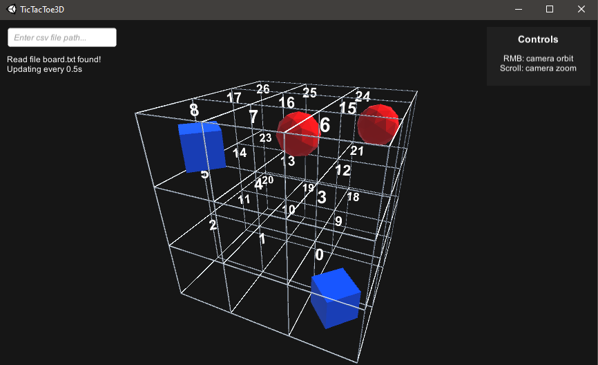

# TicTacToe 3D Visualizer

A 3D TicTacToe board visualizer for debugging 3D tictactoe boards.


[**Download Here**](https://github.com/BryanDedeur/tictactoe3d-visualizer/releases)

This progam works by reading in a state .csv file. The file should contain 27 (3^3) values. 
- player1 = -1
- player2 = 1
- empty = 0

Running program render:



example file:
```
-1,0,0,0,0,0,0,0,-1,0,0,0,0,0,0,0,1,0,0,0,0,0,0,0,1,0,0,
```

Built with [Unity Engine](https://unity3d.com/get-unity/download) 2020.3.20f1


